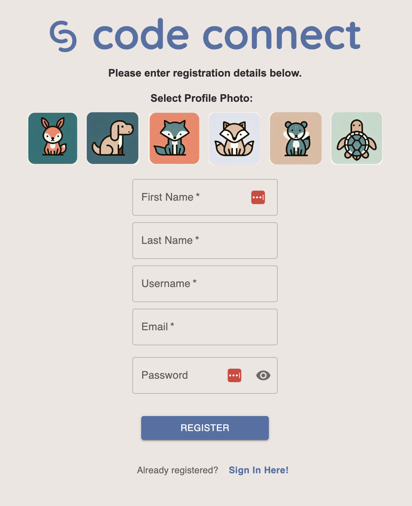
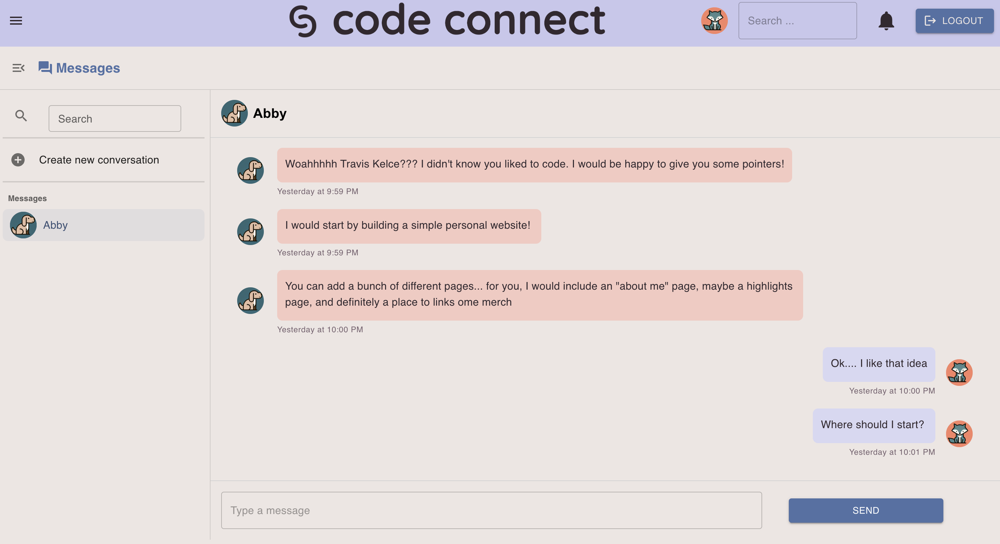
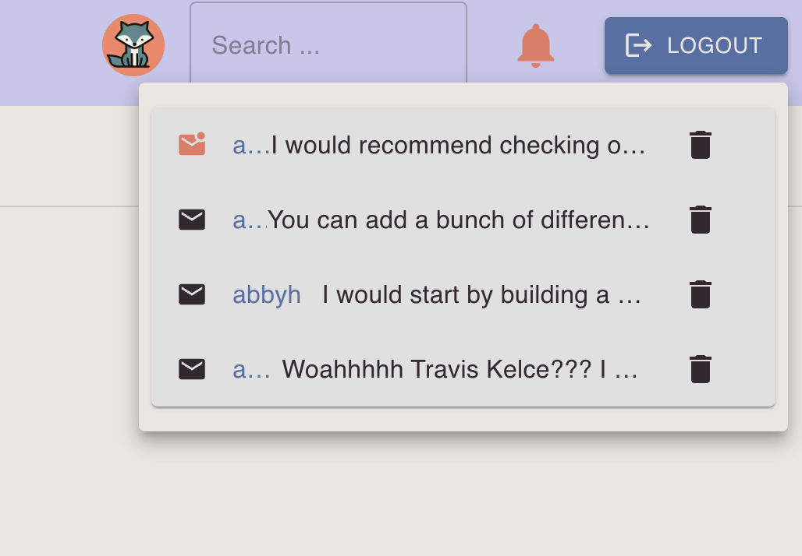
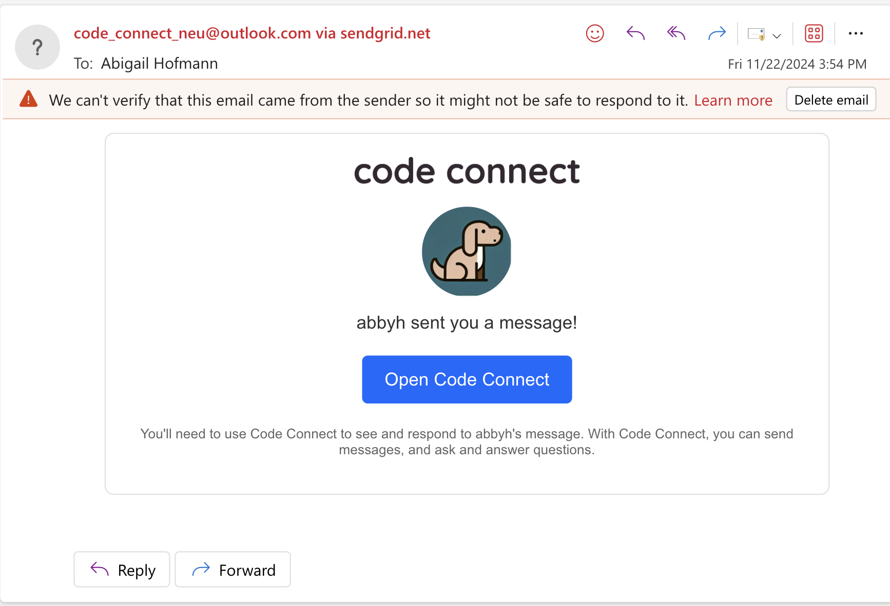
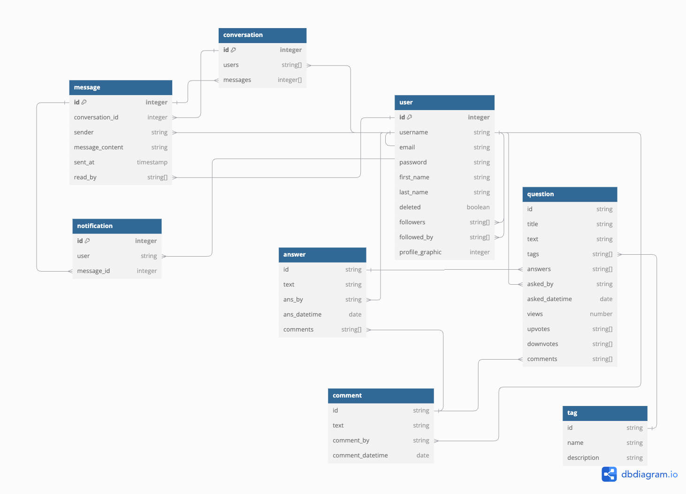

<!-- #  -->
# 

Welcome to StrideStyle, a collaborative platform where runners can archive and share outfits.

StrideStyle was inspired by a frequent conundrum faced in the midst of winter running - how the heck do I dress in these variable conditions?! What works one day might not work the next, and when you find that you are dressed appropriately, it's hard to keep track of the various factors associated with the run, including exact outfit details, weather conditions, workout details, etc. That's where StrideStyle comes into play. As a one-stop-shop runner's closet application, StrideStyle allows you to create workouts and log the outfits worn during the workout, enabling you to make note of how appropriately dressed you were. Then, for every future run, you can dress according to these logs, and use others' outfits as inspiration as well. 

StrideStyle has various features to enhance user interaction and personalization, as runners can manage their user profiles, direct message with other runners, and receive real-time notifications as a means of fostering a more engaging and connected community of runners.


#### Render Link: https://fall24-project-fall24-team-project-group-3ck6.onrender.com/ 

## Table of Contents
  * [Built With](#built-with)
  * [Features](#features)
    * [User Profiles](#user-profiles)
    * [Messaging](#messaging)
    * [Notifications](#notifications)
  * [Requirements](#requirements)
  * [Running Locally](#running-locally)
  * [Database Architecture](#database-architecture)


## Built With

* Typescript 
* React 
* MongoDB
* Material UI 
* SendGrid API
  

## Features 
StrideStyle contains the following features: 

### 1. User Profiles 
A user of StrideStyle must now register with the platform, which creates a personal user profile. Each user has an associated first name, last name, unique username, password, email address, profile graphic, followers list, and following list. There is also a boolean value indicating if a user has been deleted. 

Users can engage with one another in a variety of ways. Each user has their own personal profile page, where they can see all of their profile information and delete their profile. They can view all of the other users that they follow, as well as the users that follow them. Other users have their own profile pages, which the logged-in user can visit to follow/unfollow and view that user's profile information. 

<!--  -->


### 2. Messaging
Users of StrideStyle can also engage in direct and group messaging. Messaging is not restricted to communication between followers - any user can message any other non-deleted user. However, a user can send a blast message, where the message gets sent to each of their followers in a 1:1 conversation with that follower.

<!--  -->


### 3. Notifications 
When a user sends a message, the recipient(s) of the message will receive a notification. This notification manifests itself in multiple ways. The notification bell in the top right corner of the page will light up and the notification will be added to the dropdown of the icon. On the messaging page, the profile graphic of the conversation to which the message was sent will have a small dot to indicate the new unread message. These two notification indicators will persist until the logged-in user has opened the conversation to read the message. Additionally, the recipient(s) will receive an email informing them of a new message. 

<!-- 
 -->


## Requirements

This application requires the following to run:

  * [Node.js](https://nodejs.org/) v16.0.0+
  * [MongoDB](https://www.mongodb.com/) v4.0.0+


## Running Locally

  1. Make sure you have all of the software listed in [Requirements](#requirements)

  2. Clone this repository, and `cd` into it:

        ```sh
        git clone git@github.com:neu-cs4530/fall24-project-fall24-team-project-group-505.git; cd fall24-project-fall24-team-project-group-505
        ```

  3. Install the application dependencies in the client, server, and testing directories:

        ```sh 
        npm install
        ```

  4. Configure the necessary environment variables. 

        a. Create a file called .env at the root of the client directory. Add the following line: 
        ```sh
        REACT_APP_SERVER_URL=http://localhost:8000
        ```

        b. Create a file called .env in at the root of the server directory. Add the following lines:
        ```sh
        MONGODB_URI=mongodb://127.0.0.1:27017
        CLIENT_URL=http://localhost:3000
        PORT=8000
        ```
        You will also need to add the SENDGRID_API_KEY variable. You will have to obtain this value by setting up a free SendGrid account here: https://sendgrid.com/en-us/solutions/email-api


  4. Populate the initial database by running the following in the server directory: 
        ```sh
        npx ts-node populate_db.ts mongodb://127.0.0.1:27017/fake_so
        ```

  6. Start the application: 

        Run the following in the server directory to start an HTTP server: 

        ```sh
        npx ts-node server.ts
        ```

        Run the following in the client directory to start a client on port 3000: 

        ```sh
        npm run start
        ```


  7. Visit [localhost:8080](http://localhost:8080/) in your browser. 


## Database Architecture

The schemas for the database are documented in the directory `server/models/schema`.
<!-- A class diagram for the schema definition is shown below:

 -->

